# E-Commerce App (React Native)

📱 E-Commerce Mobile App (React Native + Expo)

This is a mobile E-Commerce application built using React Native and Expo, designed to provide a smooth and user-friendly shopping experience.

The app includes a Home page that displays products fetched from the DummyJSON API, along with essential e-commerce features such as Favorites, Cart, Orders, and Account management.

✨ Key Features

🏠 Home / Products Page – Browse products fetched from the DummyJSON API

❤️ Favorites – Save products for later

🛒 Cart – Add and manage selected products

📦 Orders – View placed orders

👤 Account Section – Manage user profile and address information

🔐 Authentication Required – Users must sign up or sign in to:

Add items to cart

Add items to favorites

Place orders

💵 Payment Method – Cash on Delivery (COD)

🛠️ Tech Stack

React Native

Expo

DummyJSON API (for products data ,get categories,search product,getsingle product details)

Context API (state management)

AsyncStorage (local data persistence)

supbase (Authentication)

## 📱 App Screenshots

### Home Page
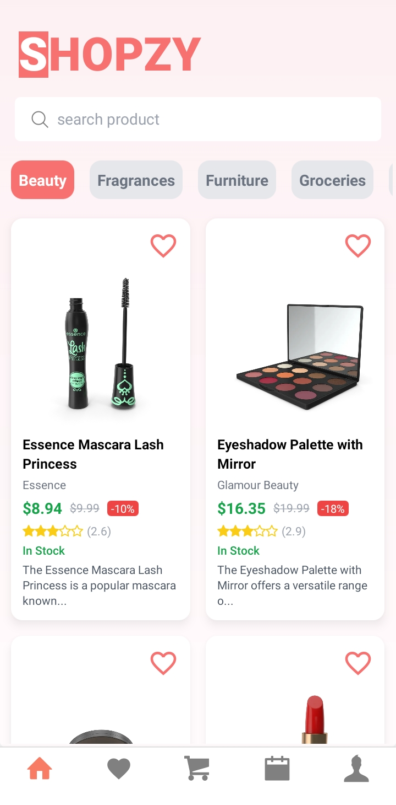

### sign in page

### Product Details Page

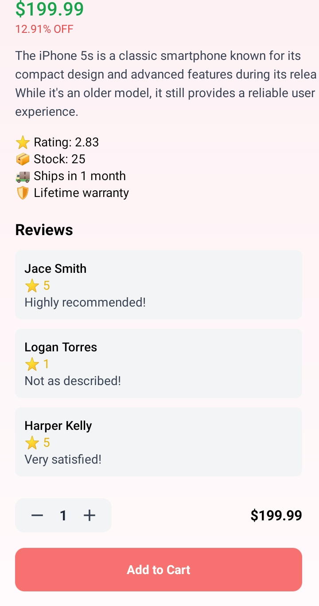

### Favorites
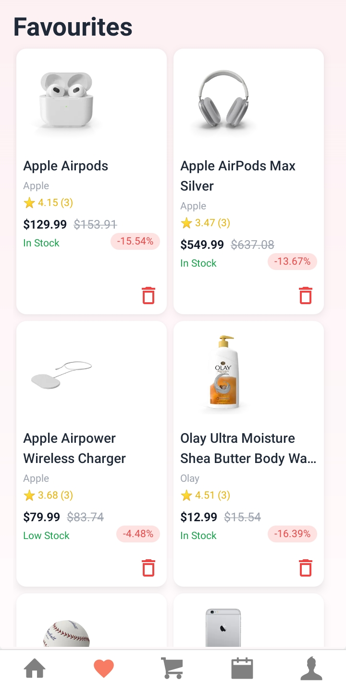

### Cart Page
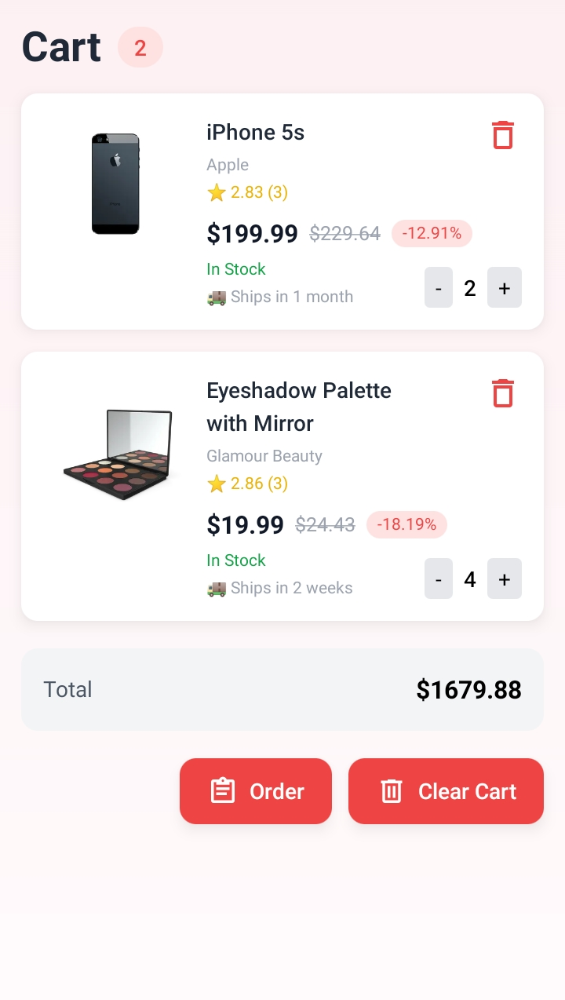

### Address Page
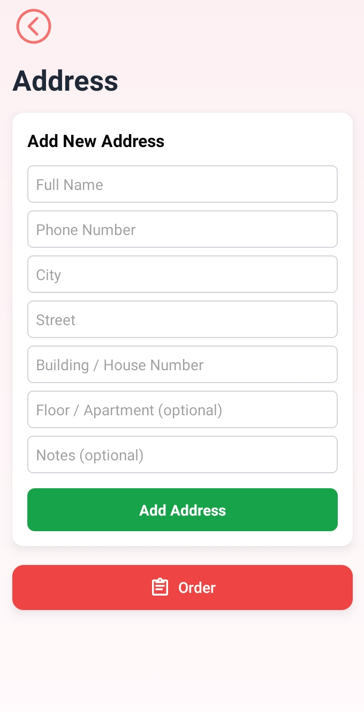
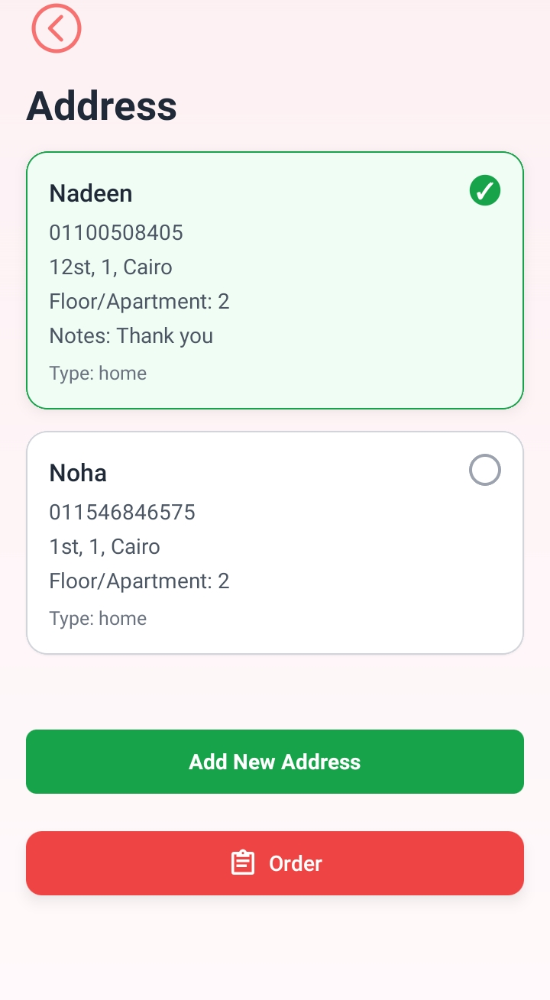
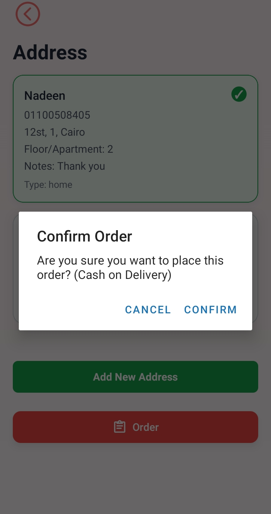

### orders Page
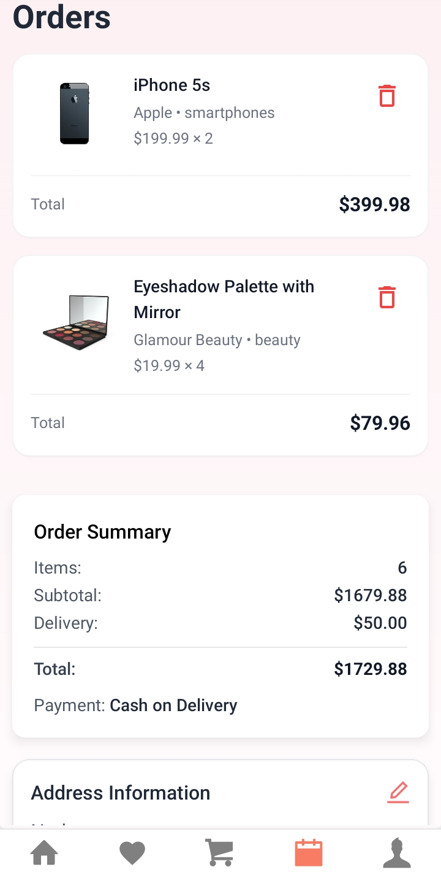
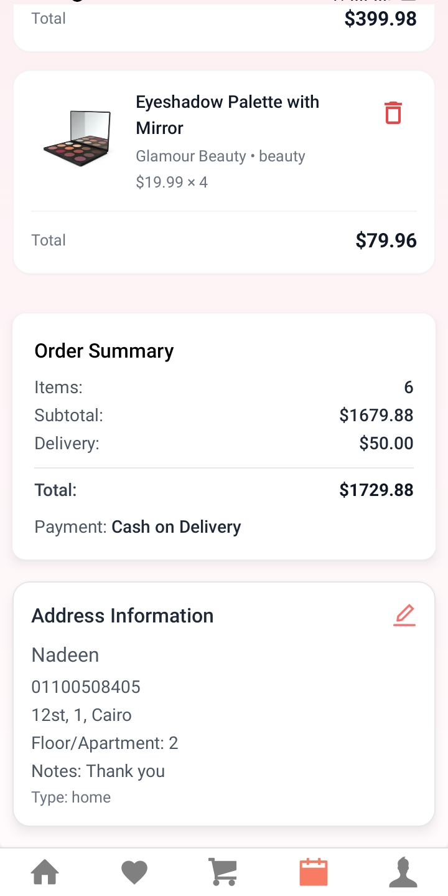

### search product
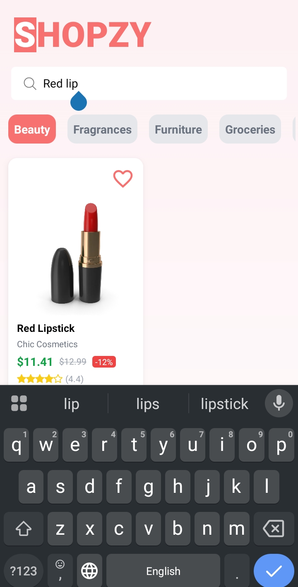

### account page
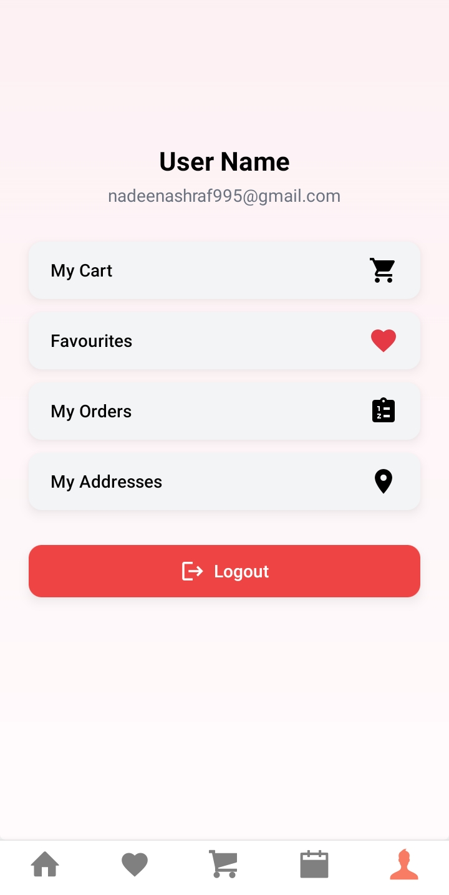

Features

🏠 Browse Products – View a list of products fetched from the DummyJSON API

🔍 Product Details – See detailed information about each product

❤️ Favorites – Add products to favorites and manage your wishlist

🛒 Cart – Add, remove, and update products in the shopping cart

📦 Orders – View your placed orders and order history

👤 Account Management – Update profile details and manage delivery address

🔐 Authentication (Supabase) – Users must sign up/sign in to:

Add items to cart

Add items to favorites

Place orders

💵 Payment Method – Cash on Delivery (COD) only

🖥️ Responsive UI – Smooth and mobile-friendly interface built with React Native + Expo

⚡ Local Data Storage – Favorites and cart data persist using AsyncStorage

## 🛠 Tech Stack
- React Native
- Expo
- TypeScript
- Context API
- AsyncStorage
- Tailwind (NativeWind)

## 📁 Project Structure
/components
/auth
    ├─ auth.ts
    └─ supabaseClient.ts

/context
    ├─ cartContext.js
    ├─ favouriteContext.js
    ├─ authContext.js
    └─ addressesContext.js

/features
    /home
        ├─ components
        └─ hooks
    /productDetails
    /cart
    /favourites
    /login
    /orders
    /address
    /accountInfo

/types
    ├─ address.ts
    ├─ home.ts
    └─ productDetails.ts

/assets
    └─ images, icons, etc.

## 🧠 State Management
- Cart,favourites,auth,address state is managed using React Context
- Data persistence is handled with AsyncStorage

## 🌐 Data Source
- DummyJSON API for products

## 🔮 Future Improvements
- Authentication
- Payment integration
- Backend API
- Order history

## 🔗 Live Demo Video

## 👤 Author
- Name: Nadeen Ashraf
- GitHub: https://github.com/Nadeenafify
- LinkedIn: https://www.linkedin.com/in/nadeen-ashraf-6795a122a/

